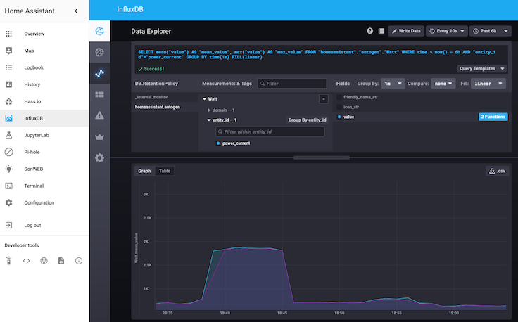

# ha-app-influxdb-1
My own Private influxdb-1 app

`! NOTE !` The original add-on has been scrapped and will no longer be maintained. 

From the "Home Assistant Community Add-on: InfluxDB"

Scalable datastore for metrics, events, and real-time analytics.

Release v 5.0.2

![Supports aarch64 Architecture][aarch64-shield]
![Supports amd64 Architecture][amd64-shield]
![Supports armhf Architecture][armhf-shield]
![Supports armv7 Architecture][armv7-shield]
![Supports i386 Architecture][i386-shield]

## About

This add-on is built on InfluxDB 1.x

InfluxDB is an open source time series database optimized for high-write-volume. It's useful for recording metrics, sensor data, events, and performing analytics. It exposes an HTTP API for client interaction and is often used in combination with Grafana to visualize the data.

This add-on comes with Chronograf & Kapacitor pre-installed. These provide a nice InfluxDB admin interface for managing your users, databases, data retention settings, and let you peek inside the database using the Data Explorer.

LINK to
https://github.com/hassio-addons/addon-influxdb/blob/main/influxdb/DOCS.md

This add-on comes with Chronograf & Kapacitor pre-installed. These provide a
nice InfluxDB admin interface for managing your users, databases, data
retention settings, and let you peek inside the database using the Data
Explorer.

[:books: Read the full add-on documentation][docs]

! IMPORTANT ! This is a fork from a previoius repo created by Franck Nijhof for the HA community. I have copied the repo to disconnect me from being depended or affected by their changes. Using this repo is on your own responsiblity. No other creator or owner of this repo does not take responsiblity for any damage or netative cause to your system, data or setup.

## License

MIT License

Copyright (c) 2018-2025 Franck Nijhof

Permission is hereby granted, free of charge, to any person obtaining a copy
of this software and associated documentation files (the "Software"), to deal
in the Software without restriction, including without limitation the rights
to use, copy, modify, merge, publish, distribute, sublicense, and/or sell
copies of the Software, and to permit persons to whom the Software is
furnished to do so, subject to the following conditions:

The above copyright notice and this permission notice shall be included in all
copies or substantial portions of the Software.

THE SOFTWARE IS PROVIDED "AS IS", WITHOUT WARRANTY OF ANY KIND, EXPRESS OR
IMPLIED, INCLUDING BUT NOT LIMITED TO THE WARRANTIES OF MERCHANTABILITY,
FITNESS FOR A PARTICULAR PURPOSE AND NONINFRINGEMENT. IN NO EVENT SHALL THE
AUTHORS OR COPYRIGHT HOLDERS BE LIABLE FOR ANY CLAIM, DAMAGES OR OTHER
LIABILITY, WHETHER IN AN ACTION OF CONTRACT, TORT OR OTHERWISE, ARISING FROM,
OUT OF OR IN CONNECTION WITH THE SOFTWARE OR THE USE OR OTHER DEALINGS IN THE
SOFTWARE.

[aarch64-shield]: https://img.shields.io/badge/aarch64-yes-green.svg
[amd64-shield]: https://img.shields.io/badge/amd64-yes-green.svg
[armhf-shield]: https://img.shields.io/badge/armhf-no-red.svg
[armv7-shield]: https://img.shields.io/badge/armv7-yes-green.svg
[commits-shield]: https://img.shields.io/github/commit-activity/y/hassio-addons/addon-influxdb.svg
[commits]: https://github.com/hassio-addons/addon-influxdb/commits/main
[contributors]: https://github.com/hassio-addons/addon-influxdb/graphs/contributors
[discord-ha]: https://discord.gg/c5DvZ4e
[discord-shield]: https://img.shields.io/discord/478094546522079232.svg
[discord]: https://discord.me/hassioaddons
[docs]: https://github.com/hassio-addons/addon-influxdb/blob/main/influxdb/DOCS.md
[forum-shield]: https://img.shields.io/badge/community-forum-brightgreen.svg
[forum]: https://community.home-assistant.io/t/home-assistant-community-add-on-influxdb/54491?u=frenck
[frenck]: https://github.com/frenck
[github-actions-shield]: https://github.com/hassio-addons/addon-influxdb/workflows/CI/badge.svg
[github-actions]: https://github.com/hassio-addons/addon-influxdb/actions
[github-sponsors-shield]: https://frenck.dev/wp-content/uploads/2019/12/github_sponsor.png
[github-sponsors]: https://github.com/sponsors/frenck
[i386-shield]: https://img.shields.io/badge/i386-no-red.svg
[issue]: https://github.com/hassio-addons/addon-influxdb/issues
[license-shield]: https://img.shields.io/github/license/hassio-addons/addon-influxdb.svg
[maintenance-shield]: https://img.shields.io/maintenance/yes/2025.svg
[patreon-shield]: https://frenck.dev/wp-content/uploads/2019/12/patreon.png
[patreon]: https://www.patreon.com/frenck
[project-stage-shield]: https://img.shields.io/badge/project%20stage-%20!%20DEPRECATED%20%20%20!-ff0000.svg
[reddit]: https://reddit.com/r/homeassistant
[releases-shield]: https://img.shields.io/github/release/hassio-addons/addon-influxdb.svg
[releases]: https://github.com/hassio-addons/addon-influxdb/releases
[repository]: https://github.com/hassio-addons/repository

